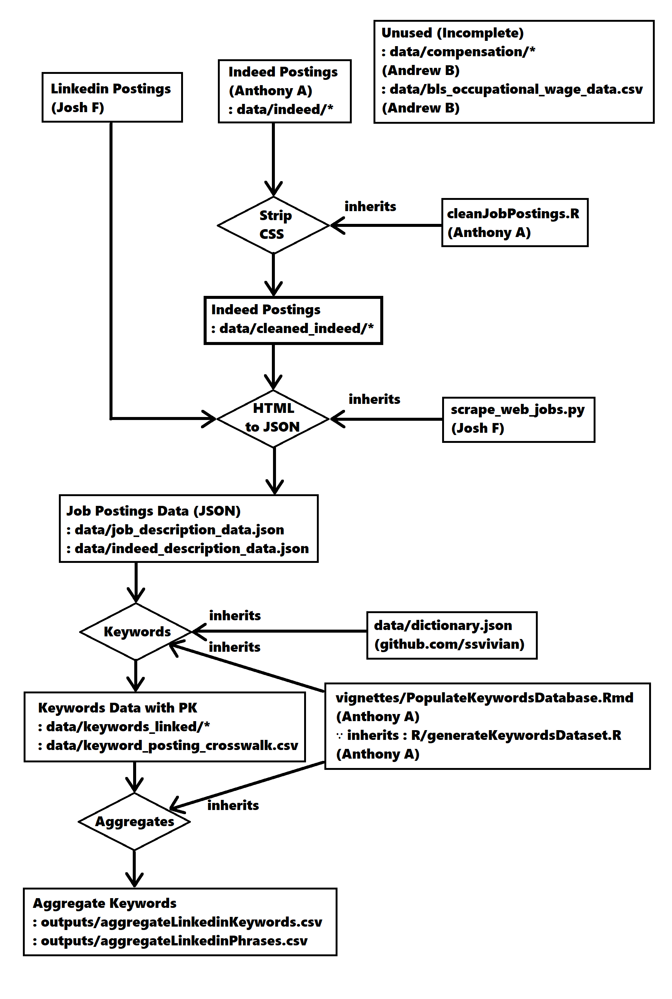
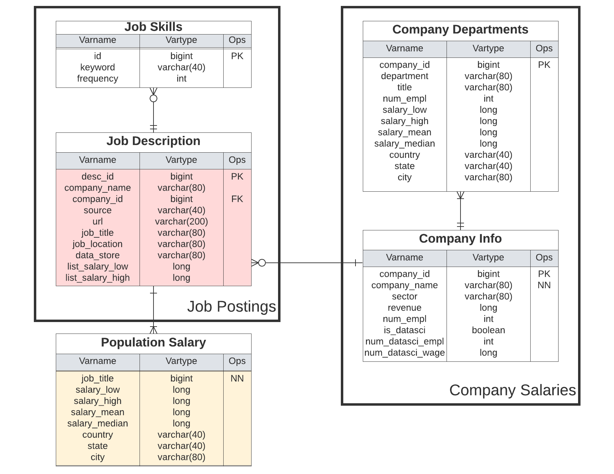

<h1> Team Science </h1>

Our team collaborated to investigate the most desirable soft skills for data scientists to get hired.
In our effort to determine this, we scraped Linkedin and Indeed for their job postings and then parsed the keyphrases with the highest occurrence.

For notebooks on how to use this project, see the vignettes/ folder.
For source code, see R/ and Python/ to find the files that suits your needs.
Additional documentation for modifying the source code can be found in the man/ folder.
Finally, you can find the whitepapers in html and pdf formats in the docs/ folder.

Our data pipeline started with using Selenium and data cleaning methods to generate a json data file.
This json data was then parsed for keywords based on its linguistic meaning.
Finally, the keyphrases were aggregated and summed for every job posting by source.

A rough schema of the available data is available from our early drafts for the data storage.
The left side shows all incorporated data structures in a general sense, whereas the company data is unavailable at this time.

We concluded from the complete aggregated data that the most valuable data scientist skills, in order, are:
  - Data Analysis
  - Data Analytics
  - Machine Learning
  - Modeling
  - Statistical Methodology
  - Python
  - SQL
  - Communication skills
  - Computer Science knowledge

<h1> Authors </h1>

Anthony Arroyo (Anthogonyst)

Josh Forster (jforster19)

Andrew Bowen (andrewbowen19)

